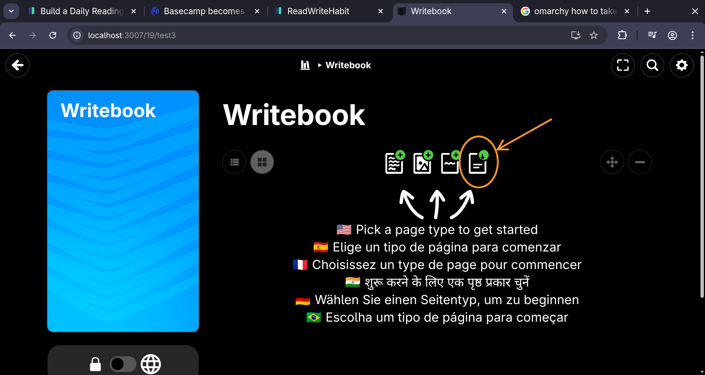

# WritebookPdfImport

A Rails engine that adds PDF import support to [Writebook](https://once.com/writebook). It parses a PDF and creates `Page` and `Picture` leaves in a book.

## Usage

An **Import PDF** button is added to the book page, allowing you to upload a PDF directly from the Writebook interface.



## Installation

Add to your `Gemfile`:

```ruby
gem "writebook_pdf_import"
```

## What it does

- Extracts text from each PDF page and creates a `Page` leaf
- Extracts embedded images (JPEG, JPEG 2000, raw RGB/grayscale/CMYK) and creates `Picture` leaves
- Uses the first line of text as the page title if it's 3–100 characters, otherwise falls back to "Page #"
- Skips blank pages

## Dependencies

- `pdf-reader ~> 2.12`
- `mini_magick` (for JPEG 2000 and raw image conversion)
- ImageMagick must be installed on the system
